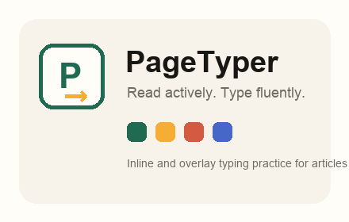

# PageTyper

PageTyper is a Chrome extension prototype that turns the article you are reading into a typing practice layer.

## MVP

- Detect likely article text from the current page.
- Open a focused typing overlay from the extension popup.
- Start an inline mode that replaces readable article blocks with per-character typing spans, then restores the original HTML on exit.
- Highlight correct, incorrect, and current characters as you type.
- Show basic progress, WPM, accuracy, and mistakes.
- Configure default mode, milestone rewards, visual effects, milestone sound, and local stats from the popup.
- Celebrate every 100 correct characters with a streak, local badges, and optional effects.

## Load Locally

1. Open `chrome://extensions`.
2. Enable **Developer mode**.
3. Click **Load unpacked**.
4. Select this folder: `pagetyper-extension`.
5. Open an article page and click the PageTyper extension icon.
6. Choose **Overlay mode** for a separate practice panel or **Inline mode** to type directly over the article text.

## Notes

Article detection is heuristic in this first version. It works best on article-like pages that use semantic containers such as `article`, `main`, `#markdown`, `data-pagefind-body`, or readable paragraph blocks.

Inline mode is intentionally conservative: links and inline formatting are simplified while typing is active, then restored when you close the mode.

Settings are saved with `chrome.storage.sync`. Milestone stats and badges are saved locally with `chrome.storage.local`.

## Chrome Web Store Assets

- Extension icons: `assets/icon-16.png`, `assets/icon-32.png`, `assets/icon-48.png`, `assets/icon-128.png`
- Small promotional image: `store-assets/promo-small-440x280.png`
- Screenshot: `store-assets/screenshot-1280x800.png`
- Listing copy: `store-listing/listing.md`
- Privacy policy: `PRIVACY.md`

## License

MIT
